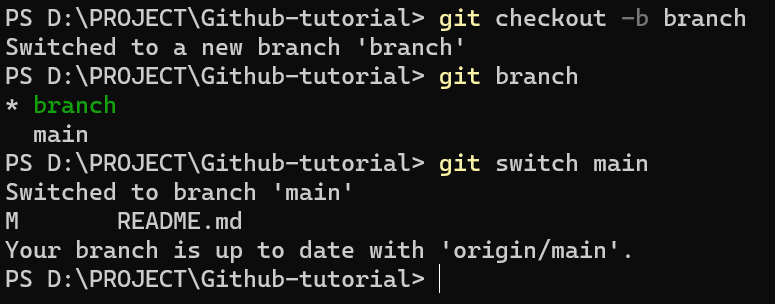
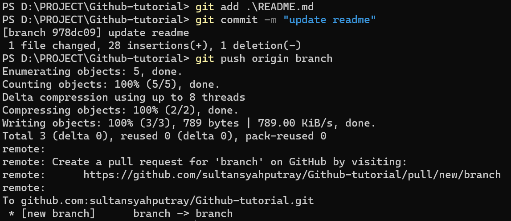
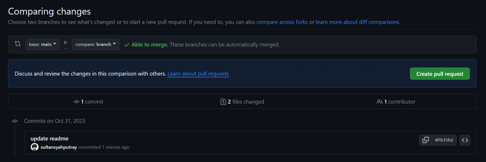
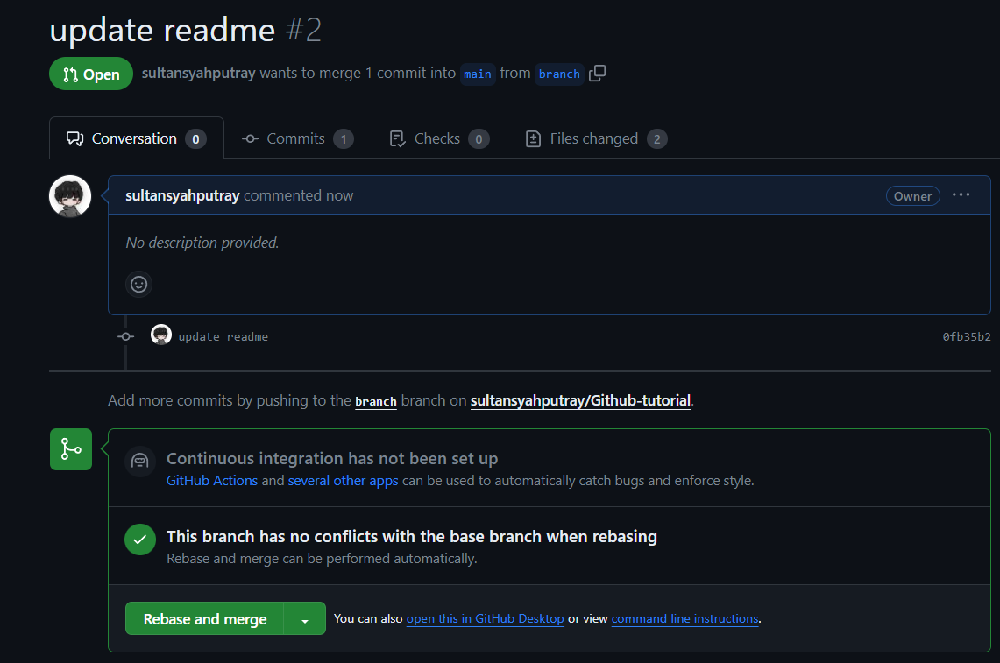

# Github-tutorial

### Konfigurasi awal (username dan email) :
```bash
git config --global user.name (username github)
```
*git config --global user.name sultansyahputray*
- git config --global user.email (email github) <br>
*git config --global user.email hahahihi@gmail.com*
*`it config --global user.email (email github)`*

### Clone repository :
- git clone (ssh atau https dari repo yg mau di clone) <br>
*git clone git@github.com:sultansyahputray/Github-tutorial.git*

### Pembuatan branch :
pentingnya bekerja bada suatu branch yang berbeda agar meminimalisir terjadi conflict antar pengguna pada repo bersama.
1. membuat branch baru :
- git checkout -b (nama branch)
*git checkout -b branch*

2. cek saat ini sedang berada pada branch apa 
- git branch

3. switching branch
- git switch (nama branch yang dituju)
*git switch main*



### Menambahkan hasil kerja ke repo
- git add (file apa yang selesai dikerjakan)
*git add Readme.md*
- git commit -m "(pesan atau catatan)"
*git commit -m "update Readme"
- git push origin (nama branch)
*git push origin branch*



### Merger branch
- buka repository yang sedang dikerjakan
- click pada menu pull request
- set agar base dari branch yang akan kita compare adalah main dan peng-comparenya adalah branch kita



- buat pull request baru
- pastikan bahwa pesan commit sudah sesuai
- jika sudah sesuai, lakukan rebase and merge




