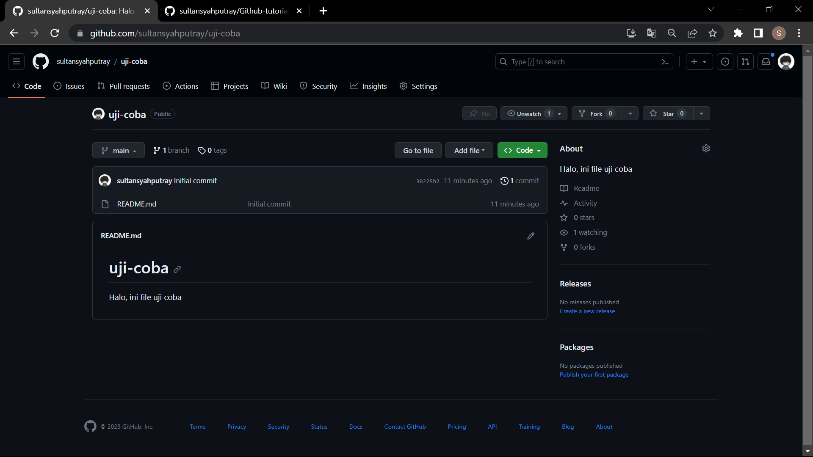

# Github-tutorial
this repository contain a simple tutorial using github and how to use it affectively

## Konfigurasi awal (username dan email) :
```bash
git config --global user.name (username github)
```
*`git config --global user.name sultansyahputray`*

```bash
- git config --global user.email (email github)
```
*`it config --global user.email hahahihi@gmail.com`*
<br>
<br>

## Clone repository :
```bash
git clone (ssh atau https dari repo yg mau di clone) 
```
*`git clone git@github.com:sultansyahputray/Github-tutorial.git`*
<br>
<br>

## Pembuatan branch :
pentingnya bekerja bada suatu branch yang berbeda agar meminimalisir terjadi conflict antar pengguna pada repo bersama.
### 1. membuat branch baru :
```bash
git checkout -b (nama branch)
```
*`git checkout -b branch`*

### 2. cek saat ini sedang berada pada branch apa 
```bash
git branch
```

### 3. switching branch
```bash
git switch (nama branch yang dituju)
```
*`git switch main`*


<br>
<br>

## Menambahkan hasil kerja ke repo
### 1. menambahkan file yang telah diubah
```bash
git add (file apa yang selesai dikerjakan)
```
*`git add Readme.md`*<br> 
*`git add .`*

### 2. Menyimpan perubahan ke repo (checkpoint)
```bash
git commit -m "(pesan atau catatan)"
```
*`git commit -m "update Readme`*

### 3. Mengupload semua perubahan pada repo lokal ke repo github
```bash
git push origin (nama branch)
```
*`git push origin branch`*
<br>
<br>

## Merger branch
Merger atau menggabungkan file dari suatu branch ke dalam branch lain membutuhkan perhatian dibeberapa hal, mulai dari apakah data yang mau kita merge sudah data yang terbaru, lalu format pesan commit, dll.

### Membuat suatu permintaan penggabungan antara branch dengan main (pull request)
- **Buka repository yang sedang dikerjakan** <br>
 

- **Click pada menu pull request** <br>
 

- **Buat pull request baru** <br>
 

- **Setting base dari branch yang akan kita compare adalah main dan peng-comparenya adalah branch kita** <br>
 

- **Lakukan pengecekan final file yang akan di merge, bandingkan kondisi sebelum commit dan sesudah commit** <br>
 

- **Creat pull request** <br>
 

- **Pastikan bahwa pesan commit sudah final dan sesuai dengan format** <br>
 

- **Jika sudah sesuai, lakukan rebase and merge** <br>
 
<br>
<br>

## Kondisi apabila terjadi conflict pada saat push ke repo atau merger
Terdapat beberap kasus dimana kita mendapati adanya conflict ketika ingin push ke github, berikut beberapa alternatif penyelesaiannya : <br>
 

### 1. Melakukan clone ulang repo
Disini kita menggunakan cara tradisional dimana kita mem-backup terlebih dahulu file yang telah kita kerjakan, lalu kita copy perubahan file kita ke repo yang akan kita clone ulang.

- **Mem-backup file yang telah kita kerjakan ke folder lain**
- **Menghapus repo lama pada lokal kita**
- **Menghapus branch kita pada repo tersebut**
- **Melakukan clone ulang pada repo yang dimaksud**
```bash
git clone (alamat ssh file yang dimaksud)
```
- **Meng-input perubahan yang sebelumnya telah kita buat ke file clone yang baru**
- **Buat branch baru, lalu push ke branch tersebut. Cek dengan membuat suatu pull request, lalu perhatikan hal yang berubah antara file pada main dengan branch kita**
- **Apabila dirasa tidak ada conflict, lanjutkan dengan rebase and merge**

### 2. Menggunakan fasilitas git pull
kondisi : <br>
 

- **Melakukan pull pada branch yang kita maksudkan untuk melakukan push**
```bash
git pull origin (nama branch)
```
*`git pull origin sultan`* <br>
 

- **Karena terdapat conflict, selesaikan terlebih dahulu file yang conflict**
 

- **Setelah diperbaiki, lalu complete merge**
- **Lakukan commit ulang untuk perubahan final**
- **Coba cek push kembali, apakah masih conflict atau tidak**
 

- **Kalau sudah tidak terjadi conflict, lanjutkan ke langkah merger**

<br><br>

## Promp Git Hub yang sewaktu-waktu dibutuhkan
### 1. Git cherry pick
cherry pick sendiri merupakan suatu fasilitas dimana kita dapat menerapkan satu atau lebih commit pada suatu branch ke branch yang lain. Hal ini seperti kita ingin meng-copy suatu commit yang pernah kita lakukan ke branch yang saat ini sedang kita kerjakan. Berikut contoh kasus saat kita menggunakan cherry pick :

- **Memilih branch yang akan kita jadikan workspace kita**
```bash
git checkout -b uji-coba
```

- **Semisal kita ingin mengambil commit di branch main, maka kita cek log commit dari branch main tersebut**
```bash
git log main
```

- **Pilih commit mana yang ingin kita ambil datanya, copy id commit yang dipilih**
```bash
git cherry-pick ce78c49b2f78e47e46f7954a804911fbe1148bed
```

- **Jika terjadi conflict, maka selesaikan terlebih dahulu file conflict nya. setelah itu lanjutkan proses cherry-pick nya**
```bash
git cherry-pick --continue
```

- **Seteah selesai, beri commit baru untuk file yang telah di modifikasi, lalu push ke branch yang kita inginkan** 
<br><br>

### 2. Git Stash
Fitur ini berguna untuk menyimpan semua progress yang telah kita kerjakan selama ini sejak commit terakhir tanpa membuat sebuah commit untuk state itu sendiri. Jadi mirip seperti checkpoint yang mana kita tidak perlu membuat save-save an ulang setiap kali terdapat sebuah pekerjaan yang baru setengah jalan dan belum mau kita commit terlebih dahulu. Berikut langkah-langkah dalam menggunakan git stash :
- **Membuat suatu checkpoint atau stash**
```bash
git stash
```

- **Mengecek daftar checkpoint/stash yang telah kita buat**
```bash
git stash list
```
biasanya setealah itu akan muncul checkpointnya dalam bentuk stash@{i} dimana {i} sesuai dengan checkpoint keberapa yang telah kita lakukan. 

- **Meng-apply checkpoint yang telah kita buat ke pekerjaan kita kembali**
```bash
git stash apply
```
```bash
git stash pop
```
perbedaan dari apply dan pop sendiri yaitu jika menggunakan apply, maka stash yang baru saja di implementasikan tidak akan dihapus dari daftar checkpoint. sedangkan kalau menggunakan pop, maka stash tersebut akan otomatis terhapuskan dari daftar checkpoint.

<br><br>
## Format penulisan pesan commit yang baik dan benar
Berikut contoh penulisan pesan commit yang baik dan benar :
```bash
<type>[optional scope] : <description>
[optional body]
[optional footer]
```

```bash
refactor : match the style coding with google style guide c++

change the style of writing a code with google style guide, so another participant will be easier to understand the code. 
```
nah untuk membuat pesan commit yang panjang seperti ini, gunakan perintah `git commit` saja, jadi tidak perlu menyertakan `-m "pesan commit"`. <br><br>
Berikut beberapa tipe commit yang dapat dijadikan referensi untuk penulisan pesan commit :

- **refactor** : mengubah codingan tanpa memperbaiki suatu bug ataupun tidak terdapat perubahan secara fungsi dari code tersebut.
- **update** : membuat suatu perubahan atau menambahkan suatu fitur dari apa yang telah ada. 
- **fix** : memperbaiki suatu bug pada code tersebut
- **revert** : kembali pada commit sebelumnya karena dirasa bahwa kinerja code lebih efektif sebelum commit yang sekarang
